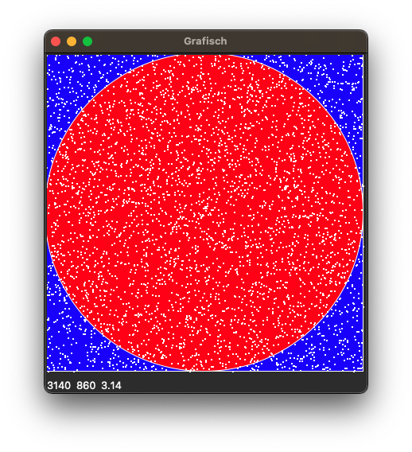

# kreis-in-quadrat
#### Wahrscheinlichkeit, dass ein zufälliger Punkt im Inkreis eines Quadrates liegt

Nach Idee zweier meiner AG-Schüler hier eine Simulation um zu zeigen, dass die Wahrscheinlichkeit, dass ein zufälliger Punkt im Inkreis eines Quadrates liegt, π/4 ist.

### Mathematische Herleitung
Die Wahrscheinlichkeit, dass ein zufälliger Punkt im Inkreis eines Quadrates liegt, ist das Verhältnis der Fläche des Inkreises zur Fläche des Quadrates. Daher:

$$ P = \frac{A_{Inkreis}}{A_{Quadrat}} = \frac{\pi r^2}{(2r)^2} = \frac{\pi}{4} $$

### Simulation
1. Punkt generieren
2. Prüfen ob Punkt im Inkreis liegt

$$ x^2 + y^2 \leq r $$

3. Anzahl der Punkte im Inkreis zählen

````python
inside, outside = 0, 0

for i in range(1000000):
    x = np.random.uniform(-1, 1)
    y = np.random.uniform(-1, 1)
    if x**2 + y**2 <= 1:
        inside += 1
    else:
        outside += 1

print(inside / (inside + outside) * 4)
````
    3.140928

### Ergebnis
Das Ergebnis ist sehr nahe an π/4 bzw. an π. Je mehr Punkte generiert werden, desto näher kommt das Ergebnis an π heran.

### Visualisierung

